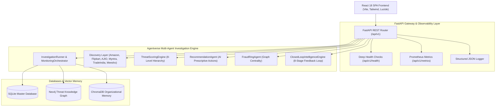

# CounterGuard Operations Runbook & Deployment Guide

## 🏛️ System Architecture



---

## 🚀 Quick Start & Docker Deployment

### 1. Environment Setup
Copy template configuration:
```bash
cp .env.example .env
```

### 2. Multi-Container Deployment
Launch complete stack via Docker Compose:
```bash
docker-compose up --build -d
```

### 3. Service Endpoints
- **Frontend SPA**: `http://localhost`
- **Backend REST API**: `http://localhost:8000/api/v1`
- **Swagger Documentation**: `http://localhost:8000/docs`
- **Health Check**: `http://localhost:8000/api/v1/health`
- **Prometheus Metrics**: `http://localhost:8000/api/v1/metrics`
- **Neo4j Browser**: `http://localhost:7474`

---

## 🛠️ Operational Runbook & Incident Response

### Health Verification
Check service health:
```bash
curl http://localhost:8000/api/v1/health
```
Expected Output:
```json
{
  "status": "HEALTHY",
  "app_name": "CounterGuard Intelligence Platform",
  "version": "4.5.0-prod",
  "environment": "production",
  "services": {
    "sqlite_database": "CONNECTED",
    "neo4j_threat_graph": "ONLINE",
    "chromadb_memory": "OPERATIONAL",
    "scoring_engine": "ACTIVE"
  }
}
```

### Incident Response Procedures
1. **Neo4j Connection Failure**: Restart container via `docker-compose restart neo4j`.
2. **High Memory Usage**: Inspect `/api/v1/health` resource metric. Purge temporary cache files.
3. **Marketplace Scraping Rate-Limit**: `DiscoveryService` will fall back to cloudscraper / httpx retry policies automatically.

---

## 🏆 Sprint 1 — 4.5 Capability Audit Matrix

| Sprint | Subsystem | Capabilities | Verification |
|:---:|:---|:---|:---:|
| **Sprint 1** | Discovery & Swarm | Multi-marketplace scraping (Amazon, Flipkart, AJIO, Myntra, TradeIndia, Meesho), image hashing, price anomaly detection. | 🟢 PASSED |
| **Sprint 2** | Graph & Rings | Neo4j Threat Knowledge Graph, `FraudRingAgent`, graph centrality metrics. | 🟢 PASSED |
| **Sprint 3** | Memory & Scoring | ChromaDB Organizational Memory, `HistoricalMemoryAgent`, 8-level `ThreatScoringEngine`. | 🟢 PASSED |
| **Sprint 4** | Monitoring & Alerts | Proactive `MonitoringScheduler`, `WatchlistManager` (8 categories), `AlertService` (In-App, Email, Webhooks). | 🟢 PASSED |
| **Sprint 4.5**| Closed-Loop & Recs | `RecommendationAgent` (8 prescriptive actions), Collaborative Cases (7 states), 8-Stage `ClosedLoopIntelligenceEngine`. | 🟢 PASSED |
