# 🛡️ CounterGuard Architectural Audit & Reverse Engineering Report

---

## 1. High-Level Workflow

The CounterGuard platform is an end-to-end anti-counterfeit threat intelligence ecosystem composed of a **Chrome MV3 Extension**, a **React (Vite + Tailwind) Web Command Center**, and a **Python (FastAPI + LangGraph) Backend Server**.

```
[ User Interaction ]
       │
       ├───────────────────────────────┐
       ▼                               ▼
Chrome Extension               Web Command Center
(DOM Extraction)               (Manual Trigger)
       │                               │
       └──────────────┬────────────────┘
                      ▼
            POST /api/v1/investigations (FastAPI)
                      │
                      ▼
         Background Daemon Thread
         (InvestigationRunner.execute)
                      │
                      ▼
       LangGraph Multi-Agent DAG Pipeline
                      │
                      ▼
         SQLite Database + Neo4j Graph
                      │
                      ▼
    Polling /api/v1/investigations/{id} (Frontend UI)
```

---

## 2. End-to-End Sequence Diagram

```mermaid
sequenceDiagram
    autonumber
    participant UI as Web Frontend / Chrome Extension
    participant API as FastAPI Router (/api/v1/investigations)
    participant DB as SQLite / Neo4j DB
    participant Runner as InvestigationRunner (Daemon Thread)
    participant Graph as LangGraph Orchestrator (StateGraph)
    participant LLM as LLMService (Groq Llama-3.3-70b / Gemini)

    UI->>API: POST /api/v1/investigations { name, brand, marketplace, target_value }
    API->>DB: Insert InvestigationModel (status="pending")
    API->>Runner: Spawns Daemon Thread (InvestigationRunner.execute)
    API-->>UI: 202 Accepted { "data": { "id": "inv_123" } }

    loop Every 2 Seconds
        UI->>API: GET /api/v1/investigations/inv_123
        API->>DB: Query status
        API-->>UI: Return { status: "pending" | "in_progress" }
    end

    Runner->>DB: Update status = "in_progress"
    Runner->>Graph: invoke(initial_state)

    rect rgb(20, 30, 50)
        note over Graph: LangGraph DAG Execution
        Graph->>Graph: Node: scraper (HTTP DOM Retrieval)
        Graph->>Graph: Node: analyzer (Rule Engine Triage)
        Graph->>Graph: Node: collector (Evidence Compilation)
        Graph->>Graph: Node: assessor (Weighted Risk Calculation)
        Graph->>Graph: Node: planner (Specialist Route Decision)

        par Parallel Specialists Execution
            Graph->>LLM: Node: price_agent
            Graph->>LLM: Node: seller_agent
            Graph->>LLM: Node: brand_agent
            Graph->>LLM: Node: review_agent
            Graph->>Graph: Node: visual (CLIP Vector Feature Match)
            Graph->>LLM: Node: brand_intel
            Graph->>LLM: Node: spec_validation
            Graph->>LLM: Node: authorized_seller
            Graph->>LLM: Node: metadata_intel
        end

        Graph->>LLM: Node: coordinator (Blackboard Synthesis)
        Graph->>Graph: Node: trusted_product (RAG Catalog Retrieval)
        Graph->>LLM: Node: reporter (Report Generation)
    end

    Graph-->>Runner: Return final_state["report"]
    Runner->>DB: Persist ReportModel & EvidenceModel events
    Runner->>DB: Ingest into Neo4j Threat Graph
    Runner->>DB: Update status = "completed"

    UI->>API: GET /api/v1/investigations/inv_123
    API->>DB: Fetch ReportModel
    API-->>UI: 200 OK { status: "completed", data: { risk_score, findings, recommendations } }
```



---

## 3. LangGraph Workflow

### Graph Architecture Specs
- **Entry Point**: `scraper`
- **State Object**: `InvestigationState` (`TypedDict` with custom reducers)
- **Parallel Fan-Out**: `planner` dynamically routes to up to 9 specialist nodes via `route_to_specialists`.
- **Fan-In / Merge**: All specialist outputs converge into the `coordinator` node.
- **Termination Node**: `reporter` $\rightarrow$ `END`.

### LangGraph DAG Flowchart

```
                 [ Start ]
                    │
                    ▼
               node: scraper
                    │
                    ▼
              node: analyzer
                    │
                    ▼
              node: collector
                    │
                    ▼
               node: assessor
                    │
                    ▼
               node: planner
                    │
        ┌───────────┴───────────┐ (Conditional Parallel Fan-Out)
        │                       │
        ▼                       ▼
   price_agent            seller_agent
   brand_agent            review_agent
   visual                 brand_intel
   spec_validation        authorized_seller
   metadata_intel
        │                       │
        └───────────┬───────────┘
                    │ (Fan-In Merge)
                    ▼
            node: coordinator
                    │
                    ▼
          node: trusted_product
                    │
                    ▼
              node: reporter
                    │
                    ▼
                 [ END ]
```

---

## 4. Agent-by-Agent Breakdown

The system incorporates **13 active nodes** in the main LangGraph DAG pipeline:

---

### 1. `ScrapingService` (`node_scrape`)
* **File Location**: `backend/services/scraping_service.py`
* **Responsibilities**: Executes live HTTP requests to retrieve listing HTML and parse product title, price, seller, ratings, images, and availability.
* **Input**: `listing_url: str`
* **Output**: `ScrapingResult` object.
* **Prompt**: None (Deterministic HTTP Parser / BeautifulSoup / Selector Engine).
* **Tools**: `httpx`, `BeautifulSoup4`.
* **External APIs**: Direct HTTP scraping target marketplace.
* **LLM Model**: None.
* **Reasoning**: Structural HTML element parsing and selector fallback.
* **Evidence Generated**: Raw title, raw price, seller name, image URLs, review count.
* **State Writes**: `state["scraping_result"]`.

---

### 2. `AnalyzerAgent` (`node_analyze`)
* **File Location**: `backend/agents/analyzer.py`
* **Responsibilities**: Triage agent running high-speed deterministic heuristic rules on scraped listing data.
* **Input**: `InvestigationRequest`, `ScrapingResult`.
* **Output**: `AnalyzerResult`.
* **Prompt**: None (Deterministic rule engine).
* **Tools**: Regex, Domain parsing utilities.
* **External APIs**: None.
* **LLM Model**: None.
* **Reasoning**: Checks seller account age, domain TLD anomalies, price thresholds, missing warranty text.
* **Evidence Generated**: Initial heuristic risk tags, brand identification.
* **State Writes**: `state["analysis"]`.

---

### 3. `EvidenceCollector` (`node_evidence`)
* **File Location**: `backend/agents/collector.py`
* **Responsibilities**: Formats raw heuristic tags into structured `EvidenceItem` records with SHA-256 hashes.
* **Input**: `AnalyzerResult`, `ScrapingResult`.
* **Output**: `EvidenceResult`.
* **Prompt**: None.
* **Tools**: Hashlib.
* **External APIs**: None.
* **LLM Model**: None.
* **Reasoning**: Evidence normalization and cryptographic hashing.
* **Evidence Generated**: Structured evidence list with initial confidence scores.
* **State Writes**: `state["evidence"]`.

---

### 4. `RiskAssessor` (`node_risk`)
* **File Location**: `backend/agents/assessor.py`
* **Responsibilities**: Computes quantitative mathematical risk baseline prior to specialist execution.
* **Input**: `AnalyzerResult`, `EvidenceResult`.
* **Output**: `RiskAssessment`.
* **Prompt**: None.
* **Tools**: Math scoring formulas.
* **External APIs**: None.
* **LLM Model**: None.
* **Reasoning**: Aggregates price deviation penalties and seller trust subtractions.
* **Evidence Generated**: Numerical risk score (0-100), preliminary risk level (`SAFE`, `MEDIUM`, `HIGH`, `CRITICAL`).
* **State Writes**: `state["risk"]`.

---

### 5. `PlanningAgent` (`planner`)
* **File Location**: `backend/agents/planner.py`
* **Responsibilities**: Dynamically selects which specialists should run during the parallel fan-out step.
* **Input**: `InvestigationState` (`request`, `risk`, `analysis`).
* **Output**: `PlanningResult` / `InvestigationPlan`.
* **Prompt**: System prompt requesting structured JSON list of specialists to invoke based on listing context.
* **Tools**: Pydantic schema validation.
* **External APIs**: Groq / Gemini / OpenAI (via `LLMService`).
* **LLM Model**: `llama-3.3-70b-versatile` (Groq) or `gemini-2.0-flash`.
* **Reasoning**: Evaluates whether image inspection, seller graph lookup, or price analysis is required for this specific product.
* **Evidence Generated**: Specialist execution plan.
* **State Writes**: `state["planning_result"]`, `state["investigation_plan"]`.

---

### 6. `PriceAgent` (`price_agent`)
* **File Location**: `backend/agents/specialists.py`
* **Responsibilities**: Evaluates price deviation against historical price records.
* **Input**: `InvestigationState`.
* **Output**: Specialist finding strings and dict entries.
* **Prompt**: System prompt evaluating price anomalies.
* **Tools**: `LivePriceVerificationTool`.
* **External APIs**: Groq / Gemini / OpenAI.
* **LLM Model**: `llama-3.3-70b-versatile`.
* **Reasoning**: Compares listing price against benchmark MSRP.
* **Evidence Generated**: Price anomaly findings.
* **State Writes**: `state["specialist_findings"]` (appended via `operator.add`), `state["specialist_evidence"]` (merged via `merge_dict`).

---

### 7. `SellerAgent` (`seller_agent`)
* **File Location**: `backend/agents/specialists.py`
* **Responsibilities**: Evaluates seller reputation, WHOIS data, and merchant registration history.
* **Input**: `InvestigationState`.
* **Output**: Specialist finding strings and dict entries.
* **Prompt**: System prompt evaluating seller trustworthiness.
* **Tools**: `LiveWhoisTool`, `LiveSellerReputationTool`.
* **External APIs**: Groq / Gemini / OpenAI.
* **LLM Model**: `llama-3.3-70b-versatile`.
* **Reasoning**: Evaluates seller domain registration age and customer feedback sentiment.
* **Evidence Generated**: Seller trust rating findings.
* **State Writes**: `state["specialist_findings"]`, `state["specialist_evidence"]`.

---

### 8. `BrandAgent` (`brand_agent`)
* **File Location**: `backend/agents/specialists.py`
* **Responsibilities**: Checks trademark registries and brand catalog permissions.
* **Input**: `InvestigationState`.
* **Output**: Specialist finding strings and dict entries.
* **Prompt**: System prompt evaluating trademark compliance.
* **Tools**: `LiveTrademarkTool`, `LiveProductCatalogTool`.
* **External APIs**: Groq / Gemini / OpenAI.
* **LLM Model**: `llama-3.3-70b-versatile`.
* **Reasoning**: Compares product title against registered trademarks.
* **Evidence Generated**: Trademark mismatch flags.
* **State Writes**: `state["specialist_findings"]`, `state["specialist_evidence"]`.

---

### 9. `ReviewAgent` (`review_agent`)
* **File Location**: `backend/agents/specialists.py`
* **Responsibilities**: Scans product reviews and images for user complaints regarding fakes.
* **Input**: `InvestigationState`.
* **Output**: Specialist finding strings.
* **Prompt**: System prompt inspecting review text.
* **Tools**: `LiveReverseImageTool`.
* **External APIs**: Groq / Gemini / OpenAI.
* **LLM Model**: `llama-3.3-70b-versatile`.
* **Reasoning**: Identifies negative review keywords like `"fake"`, `"replica"`, `"broke immediately"`.
* **Evidence Generated**: User complaint flags.
* **State Writes**: `state["specialist_findings"]`, `state["specialist_evidence"]`.

---

### 10. `VisualForensicsAgent` (`visual`)
* **File Location**: `backend/agents/visual.py`
* **Responsibilities**: Executes computer vision analysis on product image URLs.
* **Input**: `InvestigationState`.
* **Output**: `visual_similarity` (float), `visual_findings` (list of strings).
* **Prompt**: None (Deterministic visual feature extraction).
* **Tools**: Image processing libraries / PIL.
* **External APIs**: None.
* **LLM Model**: None.
* **Reasoning**: Calculates structural similarity score against brand reference images.
* **Evidence Generated**: Visual similarity percentage (e.g. 0.85).
* **State Writes**: `state["visual_similarity"]`, `state["visual_findings"]`.

---

### 11. `Intelligence Agents` (`brand_intel`, `spec_validation`, `authorized_seller`, `metadata_intel`)
* **File Location**: `backend/agents/intelligence_agents.py`
* **Responsibilities**: Specialist agents checking brand identity, specification compliance, seller authorization lists, and metadata completeness.
* **Input**: `InvestigationState`.
* **Output**: Specialist finding strings.
* **Prompt**: Specialized domain prompts.
* **Tools**: Internal knowledge base.
* **External APIs**: Groq / Gemini / OpenAI.
* **LLM Model**: `llama-3.3-70b-versatile`.
* **Reasoning**: Cross-references product attributes against known brand specifications.
* **Evidence Generated**: Domain-specific risk findings.
* **State Writes**: `state["specialist_findings"]`, `state["specialist_evidence"]`.

---

### 12. `CoordinatorAgent` (`coordinator`)
* **File Location**: `backend/agents/coordinator.py`
* **Responsibilities**: Fan-in merge node that synthesizes findings from all parallel specialists into a unified verdict.
* **Input**: `InvestigationState` (with accumulated `specialist_findings`, `specialist_evidence`, `visual_findings`).
* **Output**: `AIInvestigationResult`.
* **Prompt**: System prompt asking to synthesize contradictory specialist evidence into a definitive decision.
* **Tools**: None.
* **External APIs**: Groq / Gemini / OpenAI.
* **LLM Model**: `llama-3.3-70b-versatile`.
* **Reasoning**: Weighs conflicting signals (e.g. low price vs authorized seller status).
* **Evidence Generated**: Final AI summary, key findings list, overall confidence score.
* **State Writes**: `state["coordinator_result"]`.

---

### 13. `TrustedProductAgent` (`trusted_product`)
* **File Location**: `backend/agents/trusted_product_agent.py`
* **Responsibilities**: Executes real RAG catalog retrieval across whitelisted brand stores to locate official genuine product reference listings.
* **Input**: `InvestigationState` (`scraping_result`, `analysis`, `risk`).
* **Output**: `TrustedProductResult`, `recommended_products`.
* **Prompt**: Direct python search service invocation.
* **Tools**: `ProductSearchService`, `RetailHTTPClient`.
* **External APIs**: Direct HTTP price retrieval against whitelisted domains (`nothing.tech`, `nike.com`, `apple.com`, `samsung.com`, `sony.com`).
* **LLM Model**: None.
* **Reasoning**: Matches target product title against official brand store URLs.
* **Evidence Generated**: Official reference product comparison object.
* **State Writes**: `state["trusted_product_result"]`, `state["recommended_products"]`.

---

### 14. `ReportGenerator` (`reporter`)
* **File Location**: `backend/agents/reporter.py`
* **Responsibilities**: Compiles all findings, risk scores, evidence events, and reference products into a final `InvestigationReport` Pydantic model.
* **Input**: Scraped result, analysis, evidence, risk, coordinator result, recommended products, visual findings.
* **Output**: `InvestigationReport`.
* **Prompt**: Template synthesis for AI reasoning text.
* **Tools**: Report formatting engines.
* **External APIs**: Groq / Gemini / OpenAI.
* **LLM Model**: `llama-3.3-70b-versatile`.
* **Reasoning**: Converts technical risk factors into actionable executive summaries and recommendations.
* **Evidence Generated**: Immutable `InvestigationReport` object.
* **State Writes**: `state["report"]`.

---

## 5. Investigation State Flow

The `InvestigationState` object is defined as a `TypedDict` in `backend/state.py`:

```python
class InvestigationState(TypedDict, total=False):
    request: InvestigationRequest
    scraping_result: ScrapingResult
    analysis: AnalyzerResult
    evidence: EvidenceResult
    risk: RiskAssessment
    planning_result: PlanningResult
    investigation_plan: InvestigationPlan
    context: Annotated[InvestigationContext, merge_context]
    workspaces: Dict[str, AgentWorkspace]
    visual_similarity: float
    visual_findings: Annotated[List[str], operator.add]
    specialist_findings: Annotated[List[str], operator.add]
    specialist_evidence: Annotated[Dict[str, Any], merge_dict]
    explanation: str
    trusted_product_result: TrustedProductResult
    recommended_products: List[Dict[str, Any]]
    coordinator_result: AIInvestigationResult
    report: InvestigationReport
    status: str
    error: str
```

### Field Lifecycle & Mutators

| Field | Created At Node | Mutated By | Read By |
|---|---|---|---|
| `request` | `initial_state` | Initializer | All Nodes |
| `scraping_result` | `scraper` | `ScrapingService` | `analyzer`, `collector`, `trusted_product`, `reporter` |
| `analysis` | `analyzer` | `AnalyzerAgent` | `collector`, `assessor`, `planner`, `reporter` |
| `evidence` | `collector` | `EvidenceCollector` | `assessor`, `reporter` |
| `risk` | `assessor` | `RiskAssessor` | `planner`, `trusted_product`, `reporter` |
| `planning_result` | `planner` | `PlanningAgent` | `route_to_specialists` router |
| `specialist_findings` | Parallel Fan-Out | All Parallel Specialists (`operator.add`) | `coordinator` |
| `specialist_evidence` | Parallel Fan-Out | All Parallel Specialists (`merge_dict`) | `coordinator` |
| `visual_similarity` | `visual` | `VisualForensicsAgent` | `reporter` |
| `visual_findings` | `visual` | `VisualForensicsAgent` (`operator.add`) | `reporter` |
| `coordinator_result` | `coordinator` | `CoordinatorAgent` | `reporter` |
| `trusted_product_result` | `trusted_product` | `TrustedProductAgent` | `reporter` |
| `report` | `reporter` | `ReportGenerator` | `InvestigationService`, DB persistence |

---

## 6. Evidence Flow & Accumulation Strategy

```
[ Scraper ] ──> Raw Listing HTML
                     │
                     ▼
[ Analyzer ] ──> Generates Initial Risk Tags
                     │
                     ▼
[ Collector ] ──> Wraps Tags into EvidenceItem Array (Hashes SHA-256)
                     │
                     ▼
[ Assessor ] ──> Calculates Quantitative Baseline Risk Score
                     │
                     ▼
        ┌────────────┴────────────┐ (Parallel Specialists Fan-Out)
        │                         │
  [ PriceAgent ]            [ SellerAgent ]
        │                         │
        ▼ (Appends via operator.add) ▼ (Merges via merge_dict)
  specialist_findings       specialist_evidence
        │                         │
        └────────────┬────────────┘
                     │ (Fan-In Merge)
                     ▼
[ CoordinatorAgent ] ──> Synthesizes All Findings into AIInvestigationResult
                     │
                     ▼
[ TrustedProductAgent ] ──> Merges Official Reference Baseline
                     │
                     ▼
[ ReportGenerator ] ──> Produces Immutable InvestigationReport
```

### Evidence Mutation Rules
1. **Parallel Specialist Findings**: Appended sequentially to `state["specialist_findings"]` using LangGraph's `operator.add` reducer.
2. **Parallel Specialist Evidence Dicts**: Merged into `state["specialist_evidence"]` using `merge_dict` (key-level overwrite resolution).
3. **Context Blackboard**: Merged via `merge_context` function which deduplicates evidence IDs and observations.
4. **Final Report Assembly**: Evidence items are **never deleted or overwritten**; they are accumulated throughout the pipeline and preserved in the final report timeline.

---

## 7. Reasoning Flow & LLM Operation Matrix

| Agent | Operational Technique | Reasoning Logic | Output Decision |
|---|---|---|---|
| **`AnalyzerAgent`** | Deterministic Heuristic Rules | Evaluates price drop % against threshold, checks domain extension against whitelist. | Assigns risk tags (`PRICE_ANOMALY`, `UNVERIFIED_SELLER`). |
| **`RiskAssessor`** | Mathematical Weighted Model | Sums risk tag penalties: $\text{Total Risk} = 10.0 + \sum \text{penalties}$. | Assigns numerical score 0-100 & risk label. |
| **`PlanningAgent`** | LLM Selection Classification | Inspects product metadata to decide which specialists are necessary. | Emits JSON list of specialist names. |
| **`Specialist Agents`** | LLM Tool Execution & Analysis | Invokes live tools (WHOIS, Trademark), interprets tool response string. | Emits human-readable finding bullet points. |
| **`VisualForensicsAgent`** | Deterministic Vector Distance | Calculates visual similarity vector Euclidean/Cosine distance. | Emits similarity float (0.0 to 1.0). |
| **`CoordinatorAgent`** | LLM Synthesis & Conflict Resolution | Evaluates conflicting evidence from 9 specialists to decide true risk. | Emits final AI summary & synthesized findings. |
| **`TrustedProductAgent`** | Deterministic Catalog Search + RAG | Checks whitelisted brand dictionary, executes HTTP price retrieval. | Emits official reference comparison object. |
| **`ReportGenerator`** | LLM Executive Summarization | Transforms structured state into professional executive briefing. | Emits Markdown/JSON report summary. |

---

## 8. Product Reference Discovery Flow

> ### ⚠️ CRITICAL AUDIT FINDING
> **The current architecture DOES NOT have a dedicated general-purpose Web Search / Discovery engine (such as Google Search, Tavily, SerpAPI, Firecrawl, or Crawl4AI).**

### How Genuine Product Reference Discovery Is Currently Implemented

1. **Whitelisted Brand Dictionary (`BrandCatalogProvider`)**:
   - Located in `backend/services/product_search_service.py`.
   - Contains a **hardcoded static dictionary** of 18 whitelisted domains (`nothing.tech`, `nike.com`, `apple.com`, `samsung.com`, `sony.com`, `adidas.com`, `gucci.com`, `ray-ban.com`, `rolex.com`, `bose.com`, `dell.com`, `lenovo.com`, `microsoft.com`, `amazon.com`, `bestbuy.com`, `walmart.com`, `flipkart.com`).

2. **Direct URL Pattern Matching**:
   - `BrandCatalogProvider.search_async()` matches the brand name string against `DIRECT_CATALOGS` dictionary:
     ```python
     "nothing": "https://nothing.tech/products/",
     "nike": "https://www.nike.com/w?q=",
     "apple": "https://www.apple.com/us/search/",
     ...
     ```
   - It performs a direct HTTP `GET` request using `RetailHTTPClient` to fetch price HTML from that specific URL.

3. **Search Engine & Crawler Audit**:
   - **Google Search API**: ❌ Not Used
   - **Tavily Search API**: ❌ Not Used
   - **SerpAPI**: ❌ Not Used
   - **Firecrawl**: ❌ Not Used
   - **Crawl4AI**: ❌ Not Used
   - **Marketplace APIs**: ❌ Not Used (Uses direct HTTP scraping)
   - **Verification / Confidence**: If the HTTP retrieval succeeds, it assigns `extraction_confidence = 0.98`. If blocked or missing, it falls back to `0.30`.
   - **First Result Assumption**: Yes (`top_item = retrieved_items[0]` is automatically assumed as the reference product).

---

## 9. Current Comparison Logic

When assessing a suspicious listing, CounterGuard compares attributes against the following sources:

```
Target Listing Attributes
(Title, Price, Seller, Image, Domain)
               │
               ▼
   Compared Against:
   ├── [YES] Hardcoded Brand Catalog URLs (nothing.tech, nike.com, apple.com)
   ├── [YES] Historical SQLite Database Records (Past investigations)
   ├── [YES] Neo4j Threat Graph Nodes (Shared GST numbers / addresses)
   ├── [NO]  Live Google / Tavily Search Results (Not implemented)
   ├── [NO]  Official Brand APIs (Not implemented)
   └── [NO]  PDF Product Manuals (Not implemented)
```

---

## 10. Risk Assessment Flow

The final counterfeit probability score (0 to 100) is generated via a **Hybrid Two-Stage Process**:

```
Stage 1: Mathematical Rule Engine (backend/agents/assessor.py)
   Base Score: 10.0
   + Price Discount >= 85%:  +65 pts
   + Price Discount >= 70%:  +45 pts
   + Price Discount >= 45%:  +25 pts
   + Clone Brand In Title:   +35 pts
   + Unverified Seller:      +25 pts
   - Authorized Seller:      -15 pts
   ──────────────────────────────────
   = Baseline Risk Score (e.g. 90.0)

Stage 2: LLM Synthesis & Refinement (backend/agents/coordinator.py)
   Evaluates parallel specialist findings.
   If visual similarity < 0.60 or fraud ring cluster matched,
   the Coordinator Agent adjusts confidence & confirms final Risk Level:
   - 0 – 29:   SAFE
   - 30 – 49:  MEDIUM
   - 50 – 74:  HIGH
   - 75 – 100: CRITICAL
```

---

## 11. Report Generation Flow

```
[ Raw Scraped Metadata & Specialist Findings ]
                      │
                      ▼
[ RiskAssessor & Coordinator Synthesis ]
                      │
                      ▼
[ ReportGenerator (backend/agents/reporter.py) ]
   - Formats Pydantic InvestigationReport
   - Generates Executive AI Summary
   - Maps evidence timeline events
                      │
                      ▼
[ DB Persistence (backend/services/investigation_runner.py) ]
   - Saves ReportModel to SQLite (`reports` table)
   - Saves EvidenceModel entries to SQLite (`evidence` table)
                      │
                      ▼
[ FastAPI Response (/api/v1/investigations/{id}) ]
   - Returns JSON representation to React UI
                      │
                      ▼
[ React UI Rendering (frontend/web/src/pages/InspectTab.tsx) ]
   - Renders visual gauge, evidence cards, and export options
```

---

## 12. Architecture Strengths

1. **Robust Multi-Agent LangGraph DAG**: Clear state reduction model using `operator.add` and `merge_dict` prevents state corruption during parallel specialist fan-out.
2. **CORS & CSP Bypass Design**: Chrome background service worker delegates requests cleanly, bypassing browser extension CSP restrictions.
3. **Resilient Offline Fallbacks**: If LLM API keys or network endpoints time out, the system falls back gracefully to deterministic heuristic scoring without crashing.
4. **Dual Storage Persistence**: Combines relational SQLite storage for investigation history with Neo4j graph storage for fraud ring syndicate detection.

---

## 13. Architecture Weaknesses

1. **Static Hardcoded Brand Dictionary**: Product reference discovery relies on a hardcoded dictionary of ~18 brand domains rather than a live web search discovery agent.
2. **No Web Search API (Tavily/SerpAPI)**: If a user investigates a brand not present in the hardcoded list (e.g. a niche luxury or regional brand), official product reference discovery returns `"no_verified_products_found"`.
3. **Redundant LLM Calls in Specialist Nodes**: Parallel specialist nodes (`price_agent`, `seller_agent`, `brand_agent`, `review_agent`) invoke separate LLM calls even when simple deterministic tool evaluation is sufficient.
4. **First Result Assumption**: `TrustedProductAgent` takes `retrieved_items[0]` without secondary semantic validation against the original listing specifications.

---

## 14. Missing Components

1. **Live Discovery Web Search Tool**: Integration with Tavily, SerpAPI, or Google Custom Search API to discover official brand URLs for unlisted brands.
2. **Deep Scraper Integration (Firecrawl / Crawl4AI)**: Modern JavaScript-rendered official brand pages (React/Next.js flagships) cannot always be scraped via simple `httpx` GET requests.
3. **Dynamic Brand Knowledge Base**: Automatic ingestion of brand catalog registries rather than static dictionary definitions in Python files.

---

## 15. Recommendations BEFORE Redesign

1. **Introduce an Official Reference Discovery Stage**: Add a dedicated `DiscoveryAgent` powered by Tavily or SerpAPI before specialist fan-out so all agents compare against empirical live official web data.
2. **Implement Headless Browser Scraping for Brand Stores**: Use Crawl4AI or Playwright/Firecrawl for official brand stores that block raw `httpx` GET requests.
3. **Consolidate Parallel Specialist Prompts**: Reduce total LLM API calls by merging lightweight specialist checks into a single structured LLM evaluation pass where applicable.
